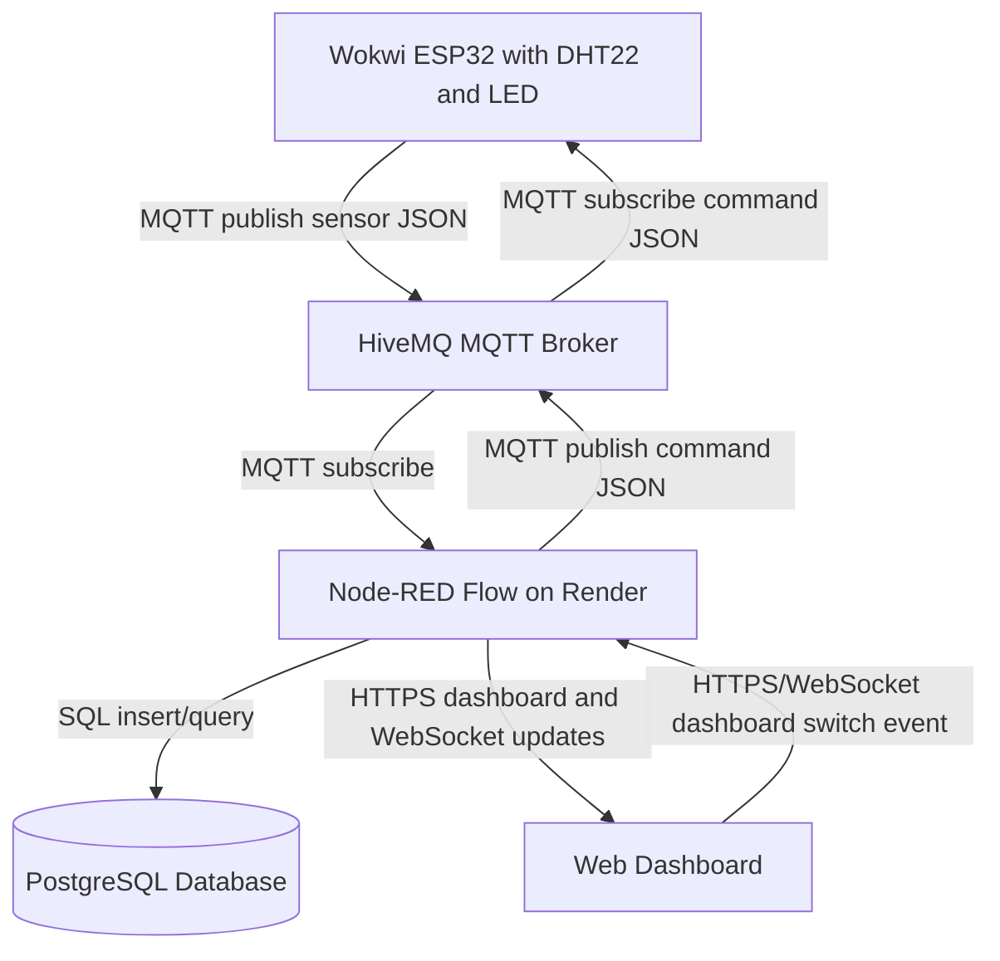

# IoT Assignment Report

## 1) Project Links

- Live Dashboard URL: https://iot-dashboard-t10c.onrender.com/ui/
- Wokwi Simulation URL: https://wokwi.com/projects/465303310096072705
- Demo Video URL: https://youtu.be/046uGnnzsqE
- Backend/Database URL: Render service at https://iot-dashboard-t10c.onrender.com/ with a managed Render PostgreSQL database
- Repository URL: https://gitlab.lnu.se/1dv027/student/wm222et/assignment-iot
- Deployment mirror URL: https://github.com/theswedishpolyglot/iot-dashboard

## 2) Project Overview

This project simulates an ESP32 device with a DHT22 temperature sensor and an LED. The device publishes temperature readings to MQTT every 5 seconds. A Node-RED flow subscribes to those readings, stores them in a database, and displays live and historical values in a Node-RED dashboard. The dashboard also has an LED switch that publishes a command back to the device over MQTT.

## 3) Architecture and Data Flow



The diagram shows how sensor data moves from the Wokwi device to the dashboard and how LED commands move back to the device.

## 4) Database Strategy

- Database chosen: PostgreSQL on Render for the deployed version. SQLite is used only for local development.
- Table: `readings`
- Columns: `id`, `value`, `device_timestamp`, `received_at`
- Query strategy: Node-RED inserts every MQTT reading into the database. The flow queries the latest 20 rows on startup, after new inserts, and every 10 seconds for the dashboard history table.

The amount of data is small: one simulated device publishes one temperature reading every 5 seconds. PostgreSQL is more than enough for this scale and makes deployment on Render straightforward.

## 5) MQTT Topics and Payload Documentation

Sensor data:

- Topic: `lnu/iot/wm222et/sensor`
- Direction: Wokwi device -> MQTT broker -> Node-RED

```json
{
  "value": 23.4,
  "timestamp": 1710063386
}
```

LED command:

- Topic: `lnu/iot/wm222et/command/led`
- Direction: Node-RED dashboard -> MQTT broker -> Wokwi device

```json
{
  "state": true
}
```

## 6) Reflection

1. Which frontend technologies did you choose, and why?

I used Node-RED Dashboard for the frontend. It provides everything needed for the dashboard inside the Node-RED flow, kept the project focused on the IoT pipeline and let me avoid building a separate custom frontend application.

2. How does handling real-time MQTT data over WebSockets differ from a standard REST API workflow?

With a standard REST API, the frontend usually requests data from the server when it needs it. For MQTT on the other hand, devices publish messages to topics, and subscribers receive those messages as events. In this project, Node-RED subscribes to the MQTT sensor topic and updates the dashboard when new readings arrive. The browser dashboard stays connected to Node-RED and receives updates without repeatedly polling a REST endpoint.

3. What was the most challenging integration step, and how did you solve it?

The most challenging part was deploying the Node-RED flow with persistent storage. Local development used SQLite, but Render's free web service filesystem is not persistent. I solved this by using Render PostgreSQL for the deployed version and converting the Node-RED database nodes at startup when Render provides the database connection string. After that, the same MQTT topics and dashboard flow worked in the deployed environment.
